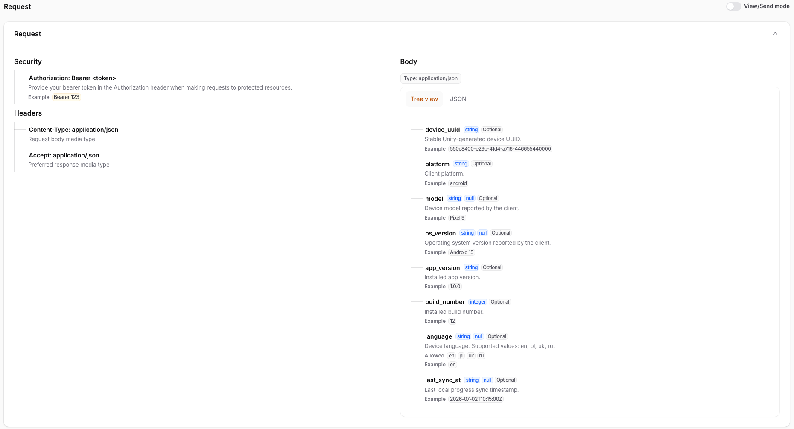
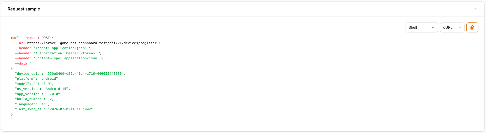
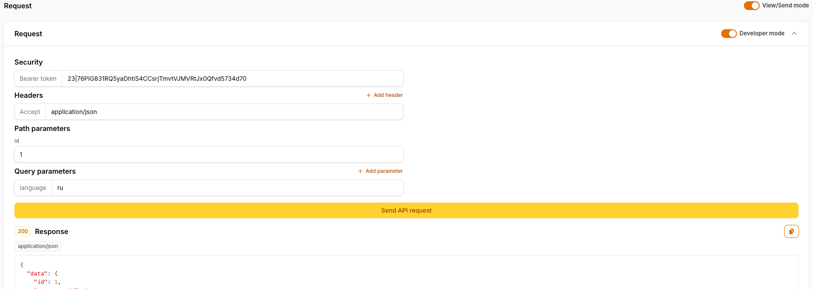
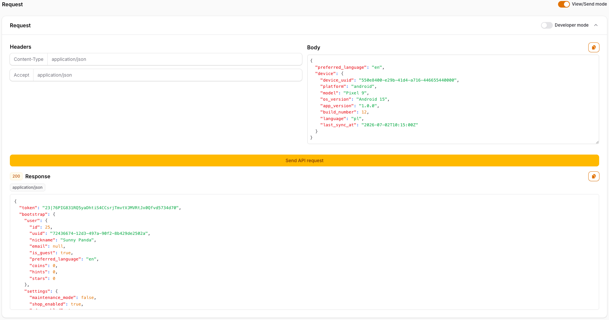
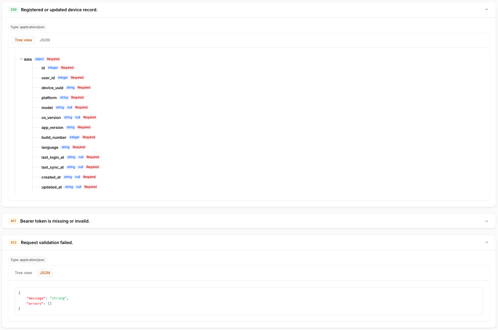

# Screenshots

## Request Documentation

Structured request documentation with security, headers, parameters, and request body schema.

## HTTP Request Snippet

Generated HTTP request snippets with language/client selectors and copy controls.

## Request Sender

Request sender with developer mode enabled for custom headers and query parameters.

## Sent Response Preview

Sent request response preview with status, content type, and highlighted body.

## Response Documentation

Documented response schemas and examples.

